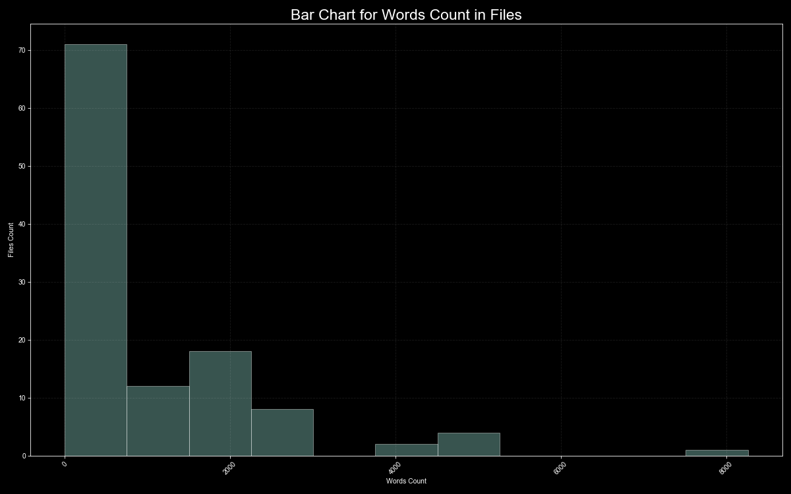

# Compatibility #

Histogramer has tested using `python 3.8` virtual environment in:

* Windows 10 OS
* macOS Catalina

# Description #

This tool analyzes text files in a directory (which was specified by user), and it's sub folders. Statistics by words
count is gathering for each text file was found. Then a histogram will be building by this statistics.

# Example #

# Installation #

* #### Using a `*.whl` dist: ####
    * Download the latest `*.whl` version from a
      [releases page](https://github.com/jim-molecule/histogramer/releases)
    * Install histogramer: `pip3 install --upgrade path_to_wheel.whl`

* #### Using sources: ####
    * Remove dist files from project root:
        * Windows: `RMDIR /Q/S build dist histogramer.egg-info`
        * Mac: `rm -r build dist histogramer.egg-info`
    * Install wheel: `pip3 install wheel`
    * Build dist: `python setup.py bdist_wheel`
    * Install histogramer: `pip3 install --upgrade path_to_wheel.whl`

# Issues #

Please, report about any issues to an
[issues page](https://github.com/jim-molecule/histogramer/issues/new/choose)
with `~/.logs` folder's files attached.

# Testing #

For run all tests, please, use `pytest ./histogramer/tests` from project root. Pytest options are placed
in `~/histogramer/tests/pytest.ini` file.

# Usage #

Run a `python -m histogramer --help` script.

# Virtual environment #

For main usage `~/requirements_main.txt` should be installed. For testing: `~/requirements_tests.txt`.
